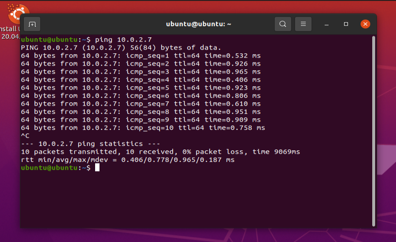
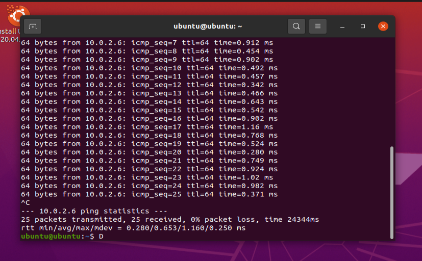
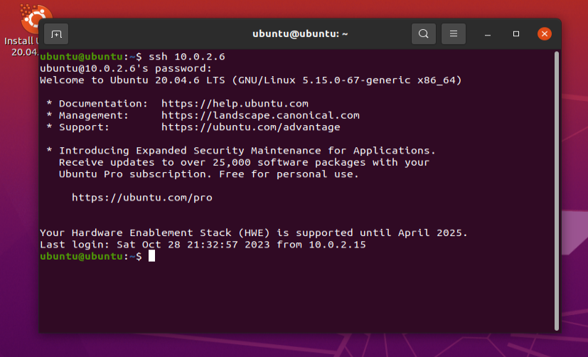

# Отчет по проделанной работе.

## Создание виртуальных машин

Для создания машин и установки сетевого доступа использовался VirtualBox, все 3 машины были на Ubuntu.

## Реализация подключения.

В качестве связи была выбрана локальная _NAT_ сеть.  .

## Проверки подключения
При помощи `curl ip` проверяется подключение машины **А** к интернету(в данном случае к сайту www.google.com)
.png)
Далее при помощи `ifconfig` узнаются ip-адреса созданных машин. В моем случае машины **А**, **Б** ,**В** имеют ip-адреса `10.0.2.15`,`10.0.2.6`,`10.0.2.7` соответственно
.png)
.png)
.png)

Затем, используя команду `ping ip` подтверждается наличие всех машин в одной сети

Ограничение по соединению устанавливается с помощью `ufw`:для всех машин изначально зарещаются все подключения с помощью команд `sudo ufw default deny incoming` и `sudo ufw default deny outgoing`. После этого отдельно разрешается подключение для машин **А** и **Б**  и для **А** и **В** с помощью `sudo ufw allow from ip`.Затем , после установки правил, запускается протокол `ufw` для всех машин - требуемое подключение готово.

Для проверки установленного подключения попробуем установить соединение через `ssh`, вот что выводит терминал при попытке подключения **A-Б** и **А-В**:

